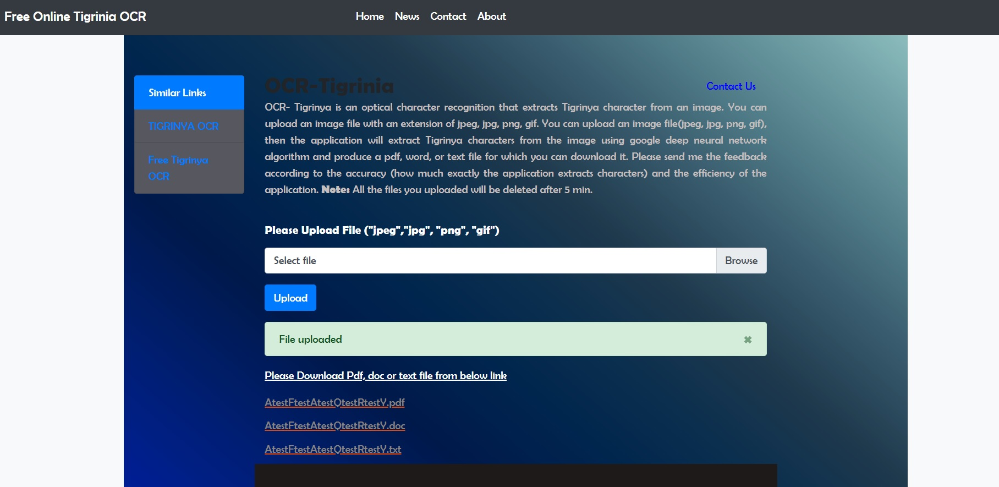
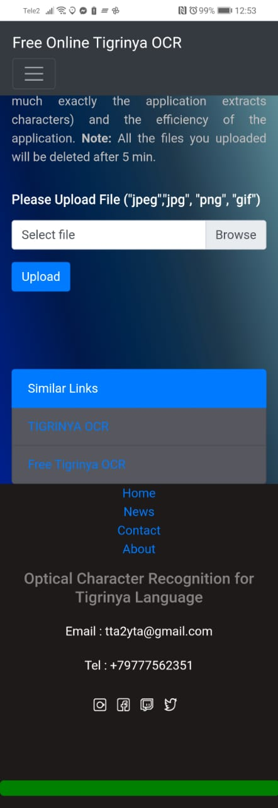

# OCR-TIGRINIA
<b>OCR-TIGRINIA</b>
OCR- Tigrinya is an optical character recognition that extracts Tigrinya character from an image.
You can upload an image file with an extension of jpeg, jpg, png, gif. You can upload an image file(jpeg, jpg, png, gif),
then the application will extract Tigrinya characters from the image using google deep neural network algorithm and produce a pdf, word, 
or text file for which you can download it. Please send me the feedback according to the accuracy (how much exactly the application extracts characters) 
and the efficiency of the application. Note: All the files you uploaded will be deleted after 5 min.

## Live Demo
https://ted-ocr-1.azurewebsites.net/ 

## Desktop

## Tablet, Mobile

## Built With

- Flask Python
- CSS
- Bootstrap
- jQuery
- JavaScript

## Live Demo

https://ted-ocr-1.azurewebsites.net/ 

## Author

👤 **Tedros Tesfay**

- Github: [tta2yta](https://github.com/tta2yta)
- Email: tta2yta@gmail.com

👤

## 🤝 Contributing

Contributions, issues and feature requests are welcome!

Feel free to check the <a href="https://github.com/tta2yta/OCR-TIGRINIA/issues" target="_blank">issues page</a>.

## Show your support

Give a ⭐️ if you like this project!

## Acknowledgments
- https://towardsdatascience.com/simple-ocr-with-tesseract-a4341e4564b6
- https://nanonets.com/blog/ocr-with-tesseract/
- https://stackabuse.com/pytesseract-simple-python-optical-character-recognition/
- https://github.com/ricktorzynski/ocr-tesseract-docker
- https://www.stackoverflow.com/
